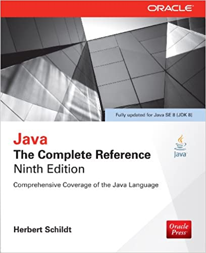
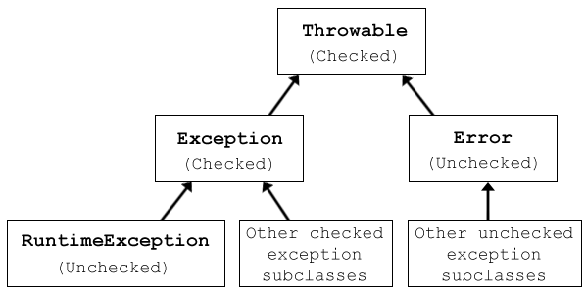
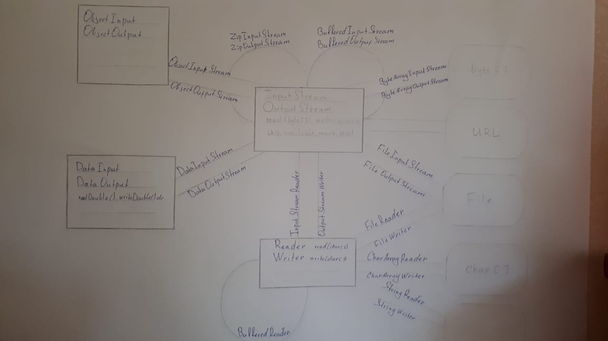

# Repository for learning javacore


In studying process the following book was used:<br/>
Author: *__Herbert Schildt__* <br/>
Book's title: __Java.__ **_The Complete Reference_** Ninth Edition




***
### Chapter that already passed and all the exercises are done:

1. #### Chapter №10

    * Exceptions' hierarchy
    * Checked / unchecked exceptions
    * try/ catch / finally structure
    * Try/catch structure  with resources
    * Block finally
    * Custom exception classes<br/>
     
    ```java
   import java.io.File;
   import java.io.FileInputStream;
   
   public class Main {
       public static void main(String[] args){
   //Открытие ресурса в блоке finally 
             try(FileInputStream inputStream = 
                   new FileInputStream(
                   new File(
                   "src/main/java/com/andreyDelay/javacore/images/Exceptions-in-Java.png")))   
           {
               //do something
           } catch(IOExeption e) {
              throw new RuntimeException(e);
           }
       }
   }
    ```
2. #### Chapter №13

    * Java IO API
    
    * InputStream / OutputStream
      * can read from/write to the following data structures:
           1. byte[] - ByteArrayInputStream
           2. URL - get Stream
           3. File - FileInputStream
      * it's decorators:
           1. GZipInputStream/GZipOutputStream
           2. BufferedInput/Output Stream
           
    * ObjectInput / ObjectOutput
      * its' adapters to Input/Output Stream:
           1. ObjectInputStream
           2. ObjectOutputStream
           
    * DataInput / DataOutput
      * it's adapters to Input/Output Stream:
           1. DataInputStream
           2. DataOutputStream
    
    * Reader / Writer for working with characters
       * it's adapter to Input/Output Stream:
           1. Input/Output StreamReader
       * without adapter can read the following structures
           1. File -FileReader/Writer
           2. char[] - CharArrayReader/Writer
           3. String - StringReader/Writer
       * it's decorator
           1. BufferedReader/Writer
           
